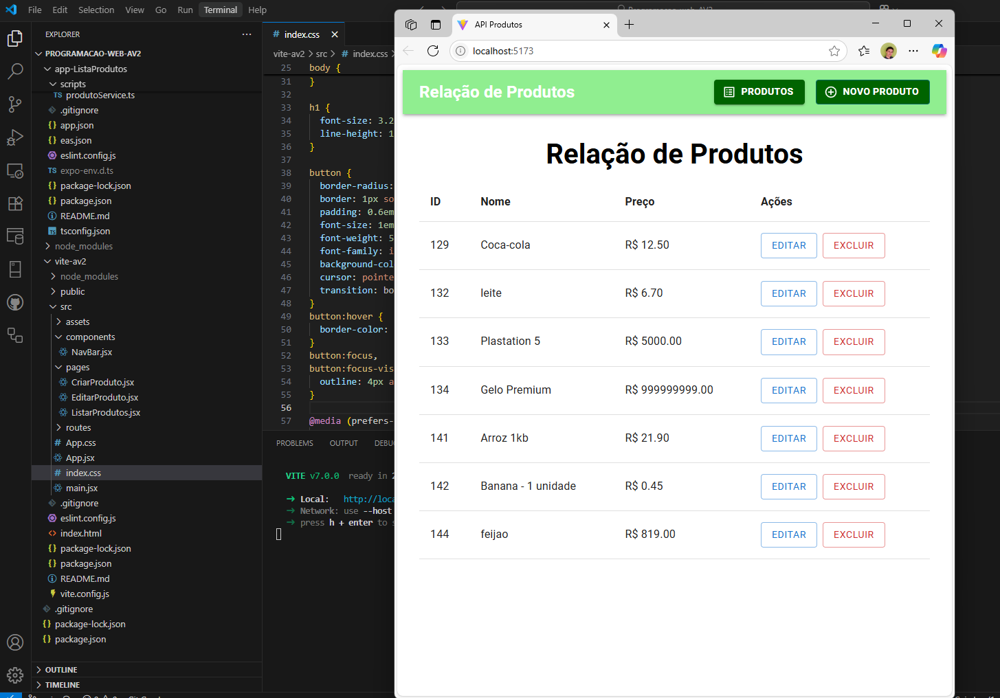
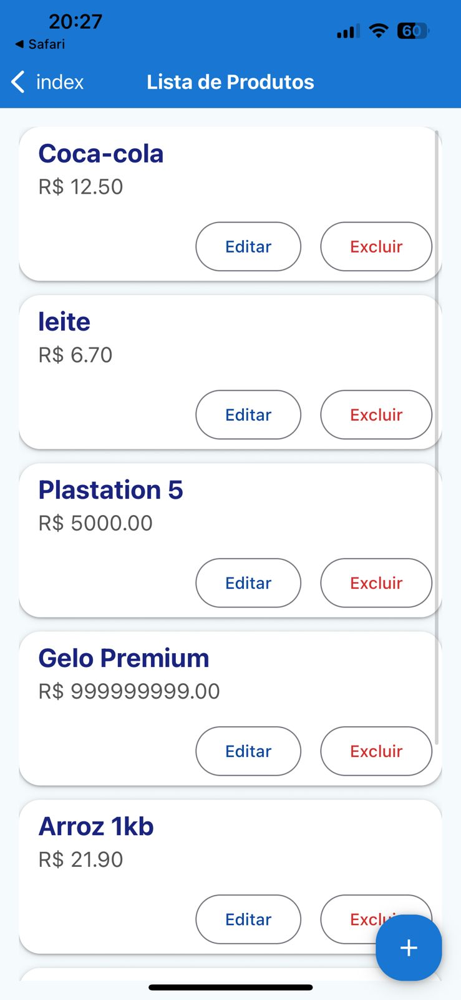

<h1>Projeto app-ListaProdutos da disciplina Programação Web 👋</h1>

<h3>O aplicativo desse projeto foi publicado online no link: </h3>
  
✔ Created @coimbradouglas/app-ListaProdutos: https://expo.dev/accounts/coimbradouglas/projects/app-ListaProdutos on EAS

---

<h3>Aplicativo de Cadastro de Produtos</h3>

<h4>Configuração do Ambiente 🛠️</h4>

Instalar o Node.js e configurar o VS Code com extensões recomendadas para React.
Criar um novo projeto React utilizando Vite.
Instalar e configurar as bibliotecas essenciais:

🎨 Material UI para o design do formulário.
🔗 Axios para comunicação com a API.
🚀 React Router para a navegação.

---

<h4>Tela Inicial da API em mobile</h4>

<h4>Tela de Relação de Produtos da API em Web</h4>

<h4>Tela de Relação de Produtos da API em mobile</h4>

---

<h4>Integração com a API 🔄</h4>

Criar funções para envio e recebimento de dados utilizando Axios.
Implementar um formulário com Material UI para cadastro de produtos.
Exibir a lista de produtos cadastrados com opções de edição e exclusão.
Garantir que a comunicação com a API esteja funcionando corretamente.
Testar a visualização no link de produtosLinks para um site externo.

---

<h4>Hospedagem 🌍</h4>

Testar a aplicação localmente para garantir que está funcionando corretamente.
Publicar no Vercel, garantindo acessibilidade online.  Para hospedar e comunicar com o api usar **https://apipw.leoproti.com.br/produtos**
Verificar a conexão da aplicação com a API após a hospedagem.

---

<h4>Testes e Melhorias ✅</h4>

Validar a entrada de dados no formulário para evitar erros.
Testar todas as funcionalidades garantindo o correto funcionamento.

---

<h4>Autor</h4>

Projeto desenvolvido por Douglas Coimbra.
