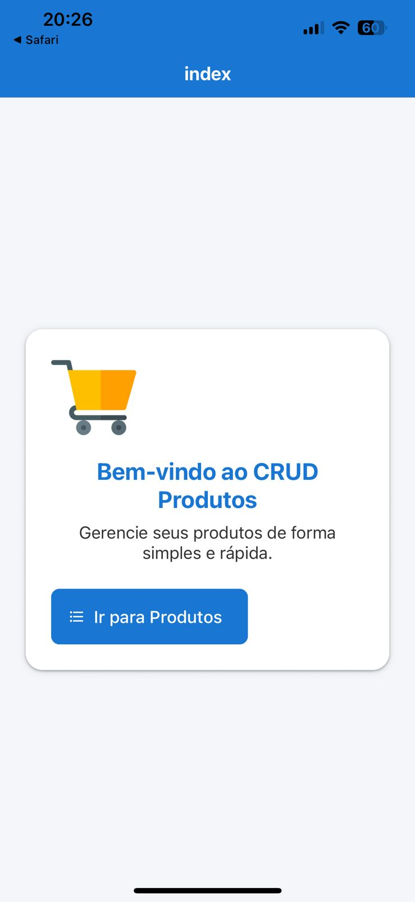

<h1>Projeto app-ListaProdutos da disciplina Programação Web 👋</h1>

<h2>O aplicativo desse projeto foi publicado online no link: ✔ Created @coimbradouglas/app-ListaProdutos: https://expo.dev/accounts/coimbradouglas/projects/app-ListaProdutos on EAS</h2>

Aplicativo de Cadastro de Produtos

1. Configuração do Ambiente 🛠️
Instalar o Node.js e configurar o VS Code com extensões recomendadas para React.
Criar um novo projeto React utilizando Vite.
Instalar e configurar as bibliotecas essenciais:
🎨 Material UI para o design do formulário.
🔗 Axios para comunicação com a API.
🚀 React Router para a navegação.

Tela Inicial da API

3. Integração com a API 🔄
Consultar a documentação da API de produtosLinks para um site externo..
Criar funções para envio e recebimento de dados utilizando Axios.
Implementar um formulário com Material UI para cadastro de produtos.
Exibir a lista de produtos cadastrados com opções de edição e exclusão.
Garantir que a comunicação com a API esteja funcionando corretamente.
Testar a visualização no link de produtosLinks para um site externo..

5. Hospedagem 🌍
Testar a aplicação localmente para garantir que está funcionando corretamente.
Publicar no Vercel, garantindo acessibilidade online.  Para hospedar e comunicar com o api usar https://apipw.leoproti.com.br/produtos
Verificar a conexão da aplicação com a API após a hospedagem.

7. Testes e Melhorias ✅
Validar a entrada de dados no formulário para evitar erros.
Testar todas as funcionalidades garantindo o correto funcionamento.
